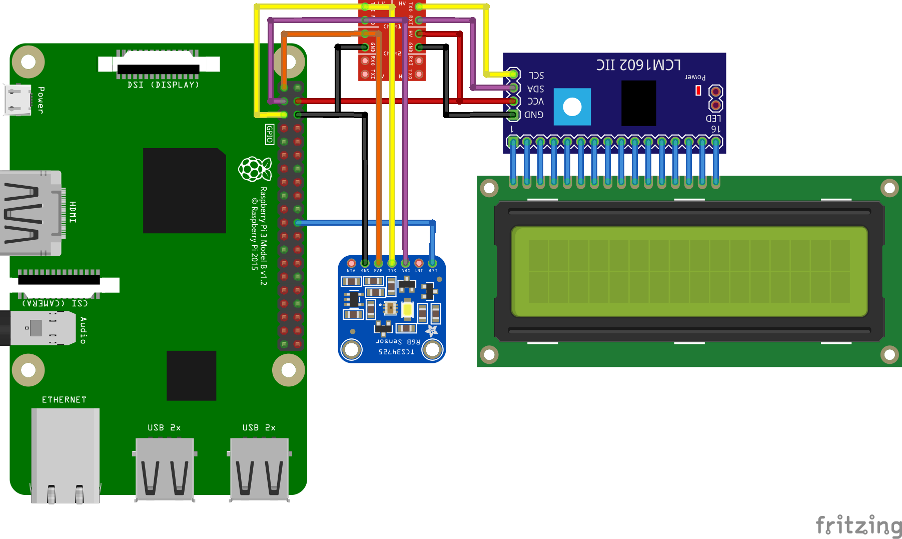

# DaSiAnThiLib (Dave's Simple Android Things Library)

Here you will find some Android Things drivers.

[  ](https://bintray.com/davemckelvie/maven/things-drivers/_latestVersion)

<!-- DRIVER_LIST_START -->
Driver | Type | Usage (add to your gradle dependencies) | Note
:---:|:---:| --- | ---
[things-driver-display](display) | Character LCD and LED display diver | `implementation 'nz.geek.android.things.driver:things-driver-display'` | [changelog](display/CHANGELOG.md)
[things-driver-pca9685](pca9685) | NXP 16 channel, 12 bit I2C PWM controller | `implementation 'nz.geek.android.things.driver:things-driver-pca9685'` | [changelog](pca9685/CHANGELOG.md)
[things-driver-pcf8574](pcf8574) | NXP 8 bit I2C IO port | `implementation 'nz.geek.android.things.driver:things-driver-pcf8574:0.8'` |  [sample]()[changelog](pcf8574/CHANGELOG.md)
[things-driver-pcf8591](pcf8591) | NXP I2C Analog to digital converter | `implementation 'nz.geek.android.things.driver:things-driver-pcf8591'` | [changelog](pcf8591/CHANGELOG.md)
<!-- DRIVER_LIST_END -->

## I2C Things


PCF8591


## Display Things

HD44870 type displays (via LCM1602)


## Colour sensor

TCS34725 I2C Colour sensor



## How to use

1. Create an Android Things project as described [here](https://developer.android.com/things/training/first-device/create-studio-project.html)
2. Add the following to your project's `build.gradle` replace `version` with [latest version](https://bintray.com/davemckelvie/maven/things-drivers/_latestVersion)
```
dependencies {
    compile 'nz.geek.android.things:things-drivers:<version>'
}
```
3. create the lcd object using an `I2cSerialCharLcd.builder()` passing module width and height
4. use the builder to setup the pin mapping between PCF8574 pins and LCD pins
5. call `lcd.connect()` to open and initialise the display
6. write something to the display
```java
@Override
protected void onCreate(Bundle savedInstanceState) {
  super.onCreate(savedInstanceState);
  I2cSerialCharLcd.I2cSerialCharLcdBuilder builder = I2cSerialCharLcd.builder(20, 4);
  builder.rs(0).rw(1).e(2).bl(3).data(4, 5, 6, 7).address(6);
  I2cSerialCharLcd lcd = builder.build();
  lcd.connect();
  lcd.print(1, "Hello World!");
}
```

## License

Copyright 2016  Dave McKelvie

Licensed under the Apache License, Version 2.0 (the "License");
you may not use this file except in compliance with the License.
You may obtain a copy of the License at

http://www.apache.org/licenses/LICENSE-2.0

Unless required by applicable law or agreed to in writing, software
distributed under the License is distributed on an "AS IS" BASIS,
WITHOUT WARRANTIES OR CONDITIONS OF ANY KIND, either express or implied.
See the License for the specific language governing permissions and
limitations under the License.
