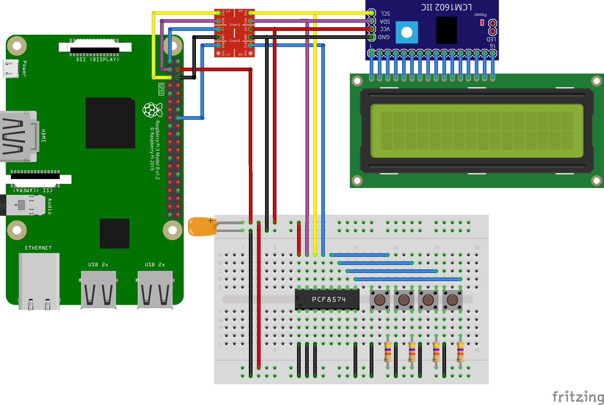

I2C button driver for Android Things
====================================

[  ](https://bintray.com/davemckelvie/maven/things-driver-button/_latestVersion)

Android Things driver for buttons connected via 8 bit I2C IO port

How to use the driver
---------------------

### Gradle dependency

To use the `button` driver, add the line below to your project's `build.gradle`,
where `<version>` matches the last version of the driver available on [jcenter][jcenter].

```
dependencies {
    compile 'nz.geek.android.things.driver:things-driver-button:<version>'
}
```

### Hardware hookup



### Sample usage

```java
import nz.geek.android.things.driver.button.I2cButton;


```

License
-------

Copyright 2018 Dave McKelvie.

Licensed to the Apache Software Foundation (ASF) under one or more contributor
license agreements.  See the NOTICE file distributed with this work for
additional information regarding copyright ownership.  The ASF licenses this
file to you under the Apache License, Version 2.0 (the "License"); you may not
use this file except in compliance with the License.  You may obtain a copy of
the License at

  http://www.apache.org/licenses/LICENSE-2.0

Unless required by applicable law or agreed to in writing, software
distributed under the License is distributed on an "AS IS" BASIS, WITHOUT
WARRANTIES OR CONDITIONS OF ANY KIND, either express or implied.  See the
License for the specific language governing permissions and limitations under
the License.

[jcenter]: https://bintray.com/davemckelvie/maven/things-driver-button/_latestVersion
