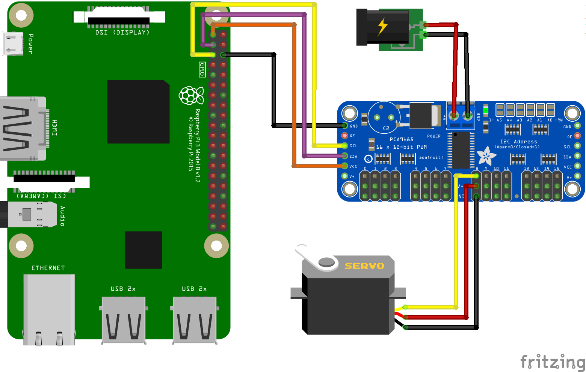

PCA9685 16 channel, 12 bit, PWM controller
==========================================

[  ][latest]

Android Things driver for the [pca9685](https://www.nxp.com/docs/en/data-sheet/PCA9685.pdf) 16 channel, 12 bit PWM controller

How to use the driver
---------------------

### Gradle dependency

To use the `pca9685` driver, add the line below to your project's `build.gradle`,
where `<version>` matches the last version of the driver available on [jcenter][latest].

```
dependencies {
    implementation 'nz.geek.android.things:things-driver-pca9685:<version>'
}
```

### Hardware hookup



### Sample usage

```java
import nz.geek.android.things.driver.pca9685.pca9685;

// Access PWM controller:
Pca9685 pca9685;

// create a PWM with an address (the value of A0-A5) and an I2C bus name
Pca9685 = pca9685.create(Pca9685Address, i2cBusName);

// Set the PWM frequency of the device. This can only be set on the device level,
// not individual pins, it is set to the last set value for any of the 16 pins.
// the minimum according to the data sheet is 24 Hz and the maximum is 1526 Hz.
pca9685.setPwmFrequencyHz(50);

// Set individual pin duty cycles, the pins are numbered 0 to 15, duty cycle
// is 0 to 100 (percent)
pca9685.setPwmDutyCycle(dutyCycle, pinNumber);

// Close the PWM controller when finished:
try {
    pca9685.close();
} catch (IOException e) {
    // error closing PWM controller
}
```

License
-------

Copyright 2018 Dave McKelvie.

Licensed to the Apache Software Foundation (ASF) under one or more contributor
license agreements.  See the NOTICE file distributed with this work for
additional information regarding copyright ownership.  The ASF licenses this
file to you under the Apache License, Version 2.0 (the "License"); you may not
use this file except in compliance with the License.  You may obtain a copy of
the License at

  http://www.apache.org/licenses/LICENSE-2.0

Unless required by applicable law or agreed to in writing, software
distributed under the License is distributed on an "AS IS" BASIS, WITHOUT
WARRANTIES OR CONDITIONS OF ANY KIND, either express or implied.  See the
License for the specific language governing permissions and limitations under
the License.

[latest]: https://bintray.com/davemckelvie/maven/things-driver-pca9685/_latestVersion

